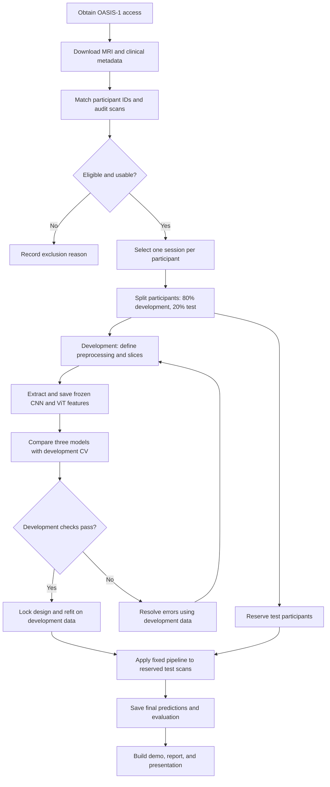
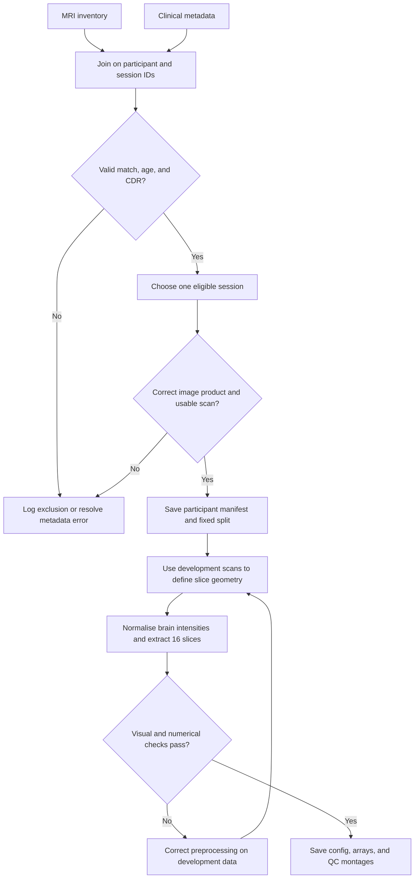
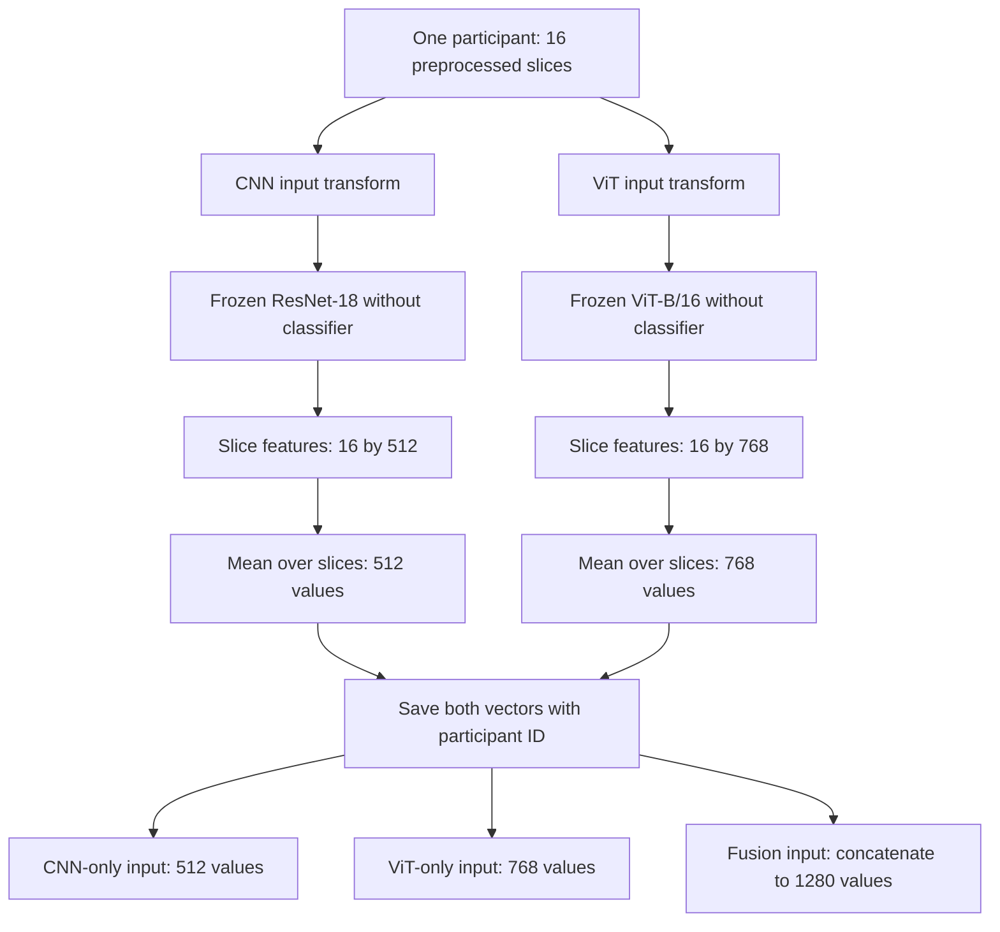
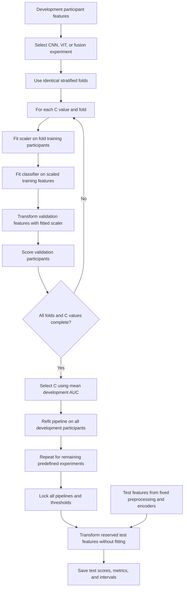
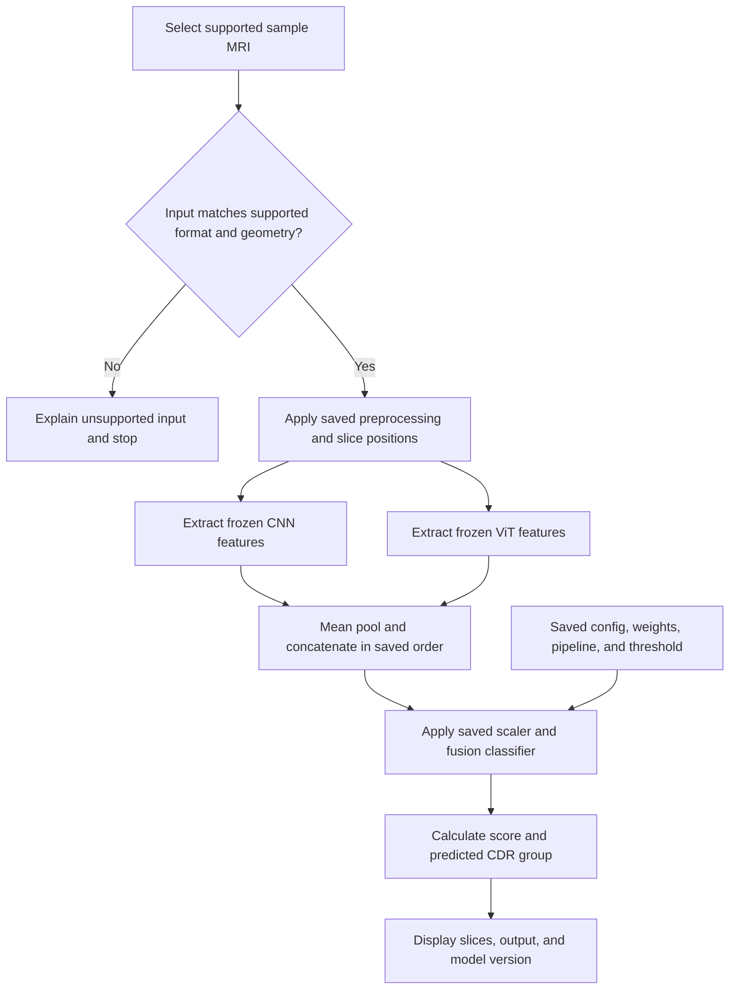

# Dementia Classification Using CNN–ViT Feature Fusion

Semester implementation guide · 5 September 2026

## Complete project flowchart

This overview covers the complete project from dataset access to submission. The diagrams use Mermaid, which renders in compatible Markdown viewers such as GitHub. Each detailed phase below explains the actions, saved outputs, and conditions for moving forward.



“Development checks pass” means the data joins, geometry, feature dimensions, training convergence, and evaluation logic are sound. It does not mean a desired accuracy has been reached. After test evaluation, further tuning requires a fresh evaluation plan; there is deliberately no feedback arrow from the test results to model selection.

### Guide navigation

| Phase | Detailed sections |
|---|---|
| Define the target and obtain data | 1–4 |
| Audit participants, split, and preprocess | 5–7 |
| Extract features and train comparison models | 8–9 |
| Evaluate and consider extensions | 10–12 |
| Build the demo and organise implementation | 13–14 |
| Schedule, submission, and troubleshooting | 15–18 |
| Execute the entire process in order | 19 |

## 1. What you will build

Build a research prototype that takes a supported, preprocessed structural brain MRI volume, extracts a fixed set of slices, obtains CNN and Vision Transformer embeddings, combines them, and predicts the participant's binary CDR group.

Suggested formal title: **Brain MRI-Based Dementia Status Classification Using CNN–Vision Transformer Feature Fusion**.

Operational target: **CDR = 0 versus CDR > 0 in a defined older-adult OASIS-1 cohort**. This is classification of a clinical rating group, not proof of Alzheimer's pathology, prediction of future dementia, or diagnosis of every dementia subtype. CDR 0.5 must be explicitly included in the positive-group definition; do not quietly relabel it as confirmed Alzheimer's disease. Read the dataset's clinical documentation before finalising terminology with your guide.

Research question: Does combining convolutional and transformer representations improve participant-level classification over either representation alone under the same evaluation protocol?

Success means a reproducible dataset pipeline, three fair comparisons, honest held-out evaluation, and a working demo. It does not require fusion to win or any promised accuracy.

## 2. Lock the first version

| Choice | Initial implementation |
|---|---|
| Dataset | Official OASIS-1 structural MRI plus clinical metadata |
| Cohort | Participants aged 60 or older, valid CDR, usable selected MRI |
| Sessions | One documented session per participant; use the earliest eligible session |
| Classes | 0: CDR = 0; 1: CDR > 0 |
| Image representation | 16 fixed axial slices per participant from a common aligned space |
| CNN | ImageNet-pretrained ResNet-18, frozen |
| Transformer | ImageNet-pretrained ViT-B/16, frozen |
| Aggregation | Mean slice embeddings separately for each branch |
| Fusion | Concatenate 512 CNN features and 768 ViT features |
| Classifier | StandardScaler followed by L2-regularised logistic regression |
| Model selection | Stratified 5-fold CV within the development participants |
| Final evaluation | Untouched 20% participant test split |
| Primary metric | Participant-level ROC-AUC |
| Secondary metrics | Balanced accuracy, sensitivity, specificity, F1, confusion matrix |
| Demo | Local interface using known, supported preprocessed scans |

These are proposed engineering defaults, not settings established to be optimal. Age restriction reduces a major shortcut but does not eliminate age confounding. Record the actual retained sample counts after access and quality control.

## 3. Dataset access and file selection

Use the [OASIS-1 official page](https://sites.wustl.edu/oasisbrains/home/oasis-1/), [access request](https://sites.wustl.edu/oasisbrains/home/access/), and [download page](https://sites.wustl.edu/oasisbrains/datasets/).

The [July 2025 access agreement](https://bpb-us-e2.wpmucdn.com/sites.wustl.edu/dist/6/4383/files/2025/07/Data-Use-Agreement_July2025.pdf) states that OASIS-1/2 downloads become available after submitting the access request. Follow the current portal's terms and acknowledge the dataset in the report. Keep downloaded data and participant-linked derivatives in authorised storage; publish code and aggregate results rather than republishing scans.

Download the clinical/demographic table, release documentation, and image archives. Start by opening 5–10 subjects, then acquire the full eligible cohort. Do not build your final experiment from whichever small archive downloaded first.

Select the release's consistently processed, brain-masked, atlas-aligned structural MRI product if supplied. Do not mix raw acquisitions, averaged native-space volumes, registered images and tissue-class maps. Inspect the release documentation to identify the exact product and suffix. Legacy distributions may use paired `.img`/`.hdr` files: retain both and confirm orientation information. NIfTI files use `.nii` or `.nii.gz`. Renaming an extension is not conversion.

If only raw images are available, add skull stripping and registration as a separate preprocessing stage; that expands the semester scope. Do not claim arbitrary raw MRI support when training uses already processed images.

## 4. Environment and resources

Use Python, PyTorch/torchvision, NumPy, pandas, NiBabel, scikit-learn, matplotlib, Pillow, joblib, and Jupyter. Streamlit is optional for a local demo.

Install a compatible torch/torchvision pair using the [official PyTorch selector](https://docs.pytorch.org/get-started/locally/) for your operating system and CUDA environment. In a managed notebook first inspect its existing installation. Then install the remaining packages:

```bash
python -m pip install numpy pandas nibabel scikit-learn matplotlib pillow joblib jupyter streamlit
python -m pip freeze > requirements-lock.txt
```

This command describes your future project environment; it has not been run as part of producing this guide.

Planning estimate: 16 GB system RAM and an 8–16 GB VRAM GPU are comfortable starting points for frozen extraction with small batches. A CPU can execute it more slowly. Start at batch size 4, increase after checking memory, and load the two encoders sequentially if necessary. Storage depends on the selected OASIS archives; inspect archive sizes and leave room for extraction instead of assuming the download size equals required disk space.

## 5. Create a participant manifest

Create one row per selected participant with these fields:

| Field | Meaning |
|---|---|
| subject_id | Stable person identifier, independent of session suffix |
| session_id | Selected session identifier |
| image_path | Selected MRI product |
| age, sex | Metadata used for cohort audit |
| cdr | Original clinical label |
| label | 0 or 1 according to the fixed mapping |
| qc_status | Pass, fail, or review |
| exclusion_reason | Missing label, wrong modality, corrupt image, etc. |
| split | Development or test |

Map the actual table's column names into this schema. Join by identifiers, never row order. Verify one-to-one joins and investigate missing matches. Missing CDR is not a control label. Drop records lacking a valid target and retain an exclusion log. Resolve repeat scans by participant identity, not filename uniqueness.

For the main MRI-only models, do not use CDR, MMSE, filenames, or diagnostic text as input features. CDR defines the target; MMSE would change the question into a clinical-plus-imaging model and can give misleading impressions of image performance.

Deliverables: `participants.csv`, `exclusions.csv`, class counts, and age/sex summaries by class.

### Data preparation flowchart



Quality-control rules should be objective and documented before examining model results. Apply the same fixed rules to reserved test scans; do not remove difficult test examples because the model predicts them incorrectly.

## 6. Split participants before preparing training examples

Create a fixed, stratified 80% development / 20% test split at the participant level. Use the same participants and folds for every model. Inspect counts to ensure both labels occur in each split and CV fold. If either class is too small for five folds, reduce to three and document why.

```python
from sklearn.model_selection import train_test_split

# df is already filtered, quality-checked, and has one row per participant.
assert df.subject_id.is_unique
dev, test = train_test_split(
    df, test_size=0.20, stratify=df.label, random_state=42
)
assert set(dev.subject_id).isdisjoint(set(test.subject_id))
```

All scans, slices, and augmented versions belonging to one person stay together. Thousands of slices are not thousands of independent participants. Do not repeat the random split until an attractive accuracy appears.

Within development data use stratified CV for regularisation selection. Fit scalers, PCA, feature selection, and classifiers inside each fold, never once on all development data before CV. The [scikit-learn leakage guide](https://scikit-learn.org/stable/common_pitfalls.html) explains why pipelines matter.

## 7. MRI preprocessing

Implement and save one deterministic preprocessing configuration:

1. Load the selected structural MRI with NiBabel. Check dimensions, finite voxel values, voxel spacing, and affine/header information. Reject unexpected 4D data rather than silently selecting a channel; only remove documented singleton dimensions.
2. Verify orientation using `nib.aff2axcodes(img.affine)`. Use `nib.as_closest_canonical(img)` only when the affine is trustworthy. For legacy formats confirm the release's orientation convention against its documentation and visual references.
3. Verify the selected images share the intended anatomical space and grid. Reorientation changes axis order; it does not register different brains. See [NiBabel orientation documentation](https://nipy.org/nibabel/image_orientation.html).
4. Use the documented brain mask. Within that mask, compute the volume's 1st and 99th intensity percentiles; clip and rescale to [0, 1]. Preserve background as zero. Handle empty masks, non-finite values and zero intensity ranges as QC failures.
5. Select 16 axial positions from a fixed anatomical range in the aligned space. Establish the range by inspecting development images only. A central-range pilot is reasonable, but inspect coverage of temporal regions and ventricles before freezing it. Save the exact positions and grid; do not choose different slices using class labels.
6. Apply the same crop and aspect-ratio-preserving resize/padding to every slice. Keep the whole chosen brain field of view. Inspect montages from both classes and verify no text or labels appear in the image.
7. Repeat the grayscale channel three times for pretrained encoders. Apply the normalisation associated with the selected pretrained weights. Do not normalise twice or apply random colour maps.

Use deterministic inputs for the frozen-feature baseline. Augmentation is optional in a later training stage and must apply only to training participants.

Deliverables: a preprocessing configuration, fixed slice coordinates, QC montages, and float arrays with shape `(16, H, W)` per participant. Numerical arrays retain more information than screenshots or lossy JPEGs.

## 8. Extract and save features

### CNN–ViT architecture and feature-storage flowchart



The CNN uses convolution to build spatial representations. The ViT uses attention between patches within each slice. Both may encode broad image information; the distinction is architectural, not a guarantee that the CNN captures only local information. Mean pooling combines slices without learning their order. The labels and IDs accompany saved features for alignment and evaluation, but never enter the MRI feature vector.

ResNet-18 produces a 512-dimensional pooled representation after removing its classifier. ViT-B/16 produces a 768-dimensional representation after removing its classification head. Their pretrained constructors and transformations are documented by [torchvision ResNet-18](https://docs.pytorch.org/vision/master/models/generated/torchvision.models.resnet18.html) and [torchvision ViT-B/16](https://docs.pytorch.org/vision/stable/models/generated/torchvision.models.vit_b_16.html).

The following is a model-setup fragment, not a complete data loader or training program:

```python
import torch
from torch import nn
from torchvision.models import (
    resnet18, ResNet18_Weights, vit_b_16, ViT_B_16_Weights
)

device = torch.device('cuda' if torch.cuda.is_available() else 'cpu')
cnn_weights = ResNet18_Weights.IMAGENET1K_V1
vit_weights = ViT_B_16_Weights.IMAGENET1K_V1
cnn = resnet18(weights=cnn_weights)
vit = vit_b_16(weights=vit_weights)
cnn.fc = nn.Identity()
vit.heads = nn.Identity()
for model in (cnn, vit):
    model.requires_grad_(False)
    model.eval().to(device)

cnn_transform = cnn_weights.transforms()
vit_transform = vit_weights.transforms()

# x_cnn and x_vit must be appropriately transformed batches for the SAME slices.
# Floating-point inputs to the transforms must already be in [0, 1].
with torch.inference_mode():
    cnn_features = cnn(x_cnn.to(device)).cpu().numpy()
    vit_features = vit(x_vit.to(device)).cpu().numpy()
```

Check that the weight transforms' central crop does not remove relevant anatomy after your field-of-view preparation. A deterministic padded input can help; record the exact sequence used. Preserve the same anatomical content across both branches.

For each participant, average the 16 vectors within each branch:

```python
import numpy as np

# Shapes for one participant: (16, 512) and (16, 768).
cnn_subject = cnn_features.mean(axis=0)
vit_subject = vit_features.mean(axis=0)
fusion_subject = np.concatenate([cnn_subject, vit_subject])
assert fusion_subject.shape == (1280,)
```

Process batches without mixing participant boundaries. Mean pooling is a simple design choice; it discards slice order and can dilute local evidence, which belongs in your limitations.

Save unscaled participant vectors in one `.npz` cache with `subject_ids`, `labels`, `cnn`, and `vit`. Align rows by subject IDs, never by coincidental file order. Save string IDs with a string dtype so loading does not require pickle. Keep development/test assignment in the manifest. Save model weight names, library versions, preprocessing configuration/hash and extraction date beside the cache.

Example sizes: for N participants, `cnn` is `(N, 512)`, `vit` is `(N, 768)`, and concatenation is `(N, 1280)`. Never concatenate the target label into the feature matrix.

Because these encoders are frozen and were pretrained independently of OASIS, their deterministic embeddings can be cached once for CV. If you later fine-tune on OASIS, train the encoder independently within each CV training fold and regenerate its cache. Reusing an encoder trained on all development participants contaminates validation folds.

## 9. Train three comparable models

### Training, validation, and final evaluation flowchart



For the frozen-encoder version, only the scaler and classifier are fitted in these folds. A later fine-tuned version must also fit its encoder inside each training fold. The age-only comparison uses the same participant folds in a separate pipeline.

Use the same pipeline and regularisation grid for CNN-only, ViT-only and fusion inputs. Logistic regression is the first classifier because the independent participant count is modest relative to the feature dimension. A large neural head is an optional later experiment.

```python
from sklearn.pipeline import Pipeline
from sklearn.preprocessing import StandardScaler
from sklearn.linear_model import LogisticRegression
from sklearn.model_selection import StratifiedKFold, GridSearchCV

pipe = Pipeline([
    ('scale', StandardScaler()),
    ('clf', LogisticRegression(
        class_weight='balanced', max_iter=5000, random_state=42
    )),
])
cv = StratifiedKFold(n_splits=5, shuffle=True, random_state=42)
search = GridSearchCV(
    pipe, {'clf__C': [0.001, 0.01, 0.1, 1.0]},
    scoring='roc_auc', cv=cv, refit=True, n_jobs=-1
)
search.fit(X_dev, y_dev)
# Repeat with each feature set using the same participant rows and folds.
```

Here `X_dev` and `y_dev` are the already aligned participant arrays for development data. Check convergence warnings rather than ignoring them. CPU parallelism can be reduced if RAM is limited.

The pipeline learns feature scaling and regularisation within folds. The best estimator is then refit on all development participants by `refit=True`. Fix the classification threshold at 0.5 initially; if selecting a threshold for a recall objective, use development out-of-fold predictions only and lock it before test evaluation. Class-weighted probability outputs are model scores, not automatically calibrated individual medical risks.

Also train a simple age-only logistic baseline to audit whether age predicts the target strongly. Keep this separate from the MRI-only comparison. Use the same CV protocol and report age distribution by label. If age effects dominate, revise the cohort or perform an age-matched sensitivity analysis using development decisions, not repeated test tuning.

## 10. Evaluate once on the final test set

Freeze the cohort definition, preprocessing, architecture choices, regularisation, and threshold before accessing test performance. Evaluate the three predeclared imaging pipelines and the age baseline as a planned comparison; do not use the resulting table to tune another version on the same test set.

Report participant-level ROC-AUC, balanced accuracy, sensitivity for CDR > 0, specificity for CDR = 0, F1, and raw confusion-matrix counts. Accuracy can be included but should not stand alone. State participant counts and class prevalence.

Use bootstrap confidence intervals by resampling participants, not slices. For paired fusion-versus-CNN differences, resample the same participant indices for both models. Skip bootstrap draws lacking both classes when calculating ROC-AUC. Report small-test-set uncertainty and avoid declaring superiority when evidence is weak.

Save a row per participant containing subject ID, true target, each model score, prediction and locked threshold. Create ROC curves and confusion matrices from those saved predictions. Fill the following table only with observed results:

| Model | Dev CV AUC | Test AUC with interval | Balanced accuracy | Sensitivity | Specificity | F1 |
|---|---|---|---|---|---|---|
| Age-only baseline | Pending | Pending | Pending | Pending | Pending | Pending |
| CNN features | Pending | Pending | Pending | Pending | Pending | Pending |
| ViT features | Pending | Pending | Pending | Pending | Pending | Pending |
| CNN + ViT features | Pending | Pending | Pending | Pending | Pending | Pending |

CV scores used for hyperparameter selection are development estimates, not an unbiased substitute for final testing. If fusion performs worse, discuss redundancy, dimensionality and overfitting; the result still answers the research question.

## 11. Optional improvement after the baseline works

Choose one extension within the remaining time:

- Fine-tune the final CNN block using training participants only, with early stopping on participant-level validation performance. Keep equal slice counts per participant and evaluate aggregated predictions. For CV, repeat fine-tuning within each fold.
- Compare 8 versus 16 slices as a predeclared development experiment.
- Compare mean pooling with a small learned attention pooling module, trained only within training folds.
- Add PCA inside the sklearn pipeline and tune component counts that are smaller than each training-fold sample count.
- Add a calibrated score using development data, if you need probabilistic interpretation.

Do not train a ViT from scratch for the initial semester version. Start with an extension only after the complete baseline and evaluation code run correctly. Freezing features greatly reduces compute, but pretrained natural-image representations may not capture MRI-specific differences well.

## 12. Explainability that matches the model

An optional occlusion map can operate on the actual fused classifier: hide a small patch in one selected slice, rerun both encoders, recompute the participant mean features and classifier score, and display the score change. Cache the unaffected slice embeddings to reduce repeated work. Use a documented masking value and acknowledge that artificial occlusion can itself be out of distribution.

Grad-CAM on an unrelated CNN head does not explain the final fused logistic model. Transformer attention weights are not proof of disease location. Label heatmaps as model sensitivity visualisations, not lesion maps or clinical evidence. The MVP is complete without heatmaps.

## 13. Build a controlled local demo

### Prediction flowchart



This diagram shows fusion inference. For a CNN-only or ViT-only demo, use that branch and its own saved classifier pipeline. No model fitting, clinical-label lookup, or threshold adjustment happens during prediction. Load the same saved configuration before preprocessing as well as before classification; the model bundle identifies the complete inference procedure.

The simplest demo lets the examiner select an authorised sample scan that has passed your preprocessing pipeline. Display representative MRI slices, predicted CDR group, model score, and the chosen model. Keep the ground-truth label separately available for demonstration and evaluation.

Support arbitrary uploaded scans only after validating their modality, orientation, alignment and preprocessing. An arbitrary MRI screenshot or phone photo is not equivalent to your training input and should be rejected. Do not ask the user to provide a CDR score to make a prediction.

The inference path must reuse the saved preprocessing config, encoder weights, slice positions, mean pooling, feature order, scaler, classifier and threshold. Save a version identifier with every prediction. Use an explicit message: 'Research prototype: predicts the study's CDR group; not a clinical diagnosis.'

Run the demo locally unless the dataset terms and your institution permit the proposed hosting and access. Keep model loading files trusted; do not accept uploaded pickle/joblib files.

## 14. Suggested project modules

These are planned modules to implement, not files already supplied with this guide.

| Module or output | Responsibility |
|---|---|
| `01_audit_data.ipynb` | Inspect image products, metadata joins, cohort and quality |
| `02_prepare_slices.ipynb` | Fixed preprocessing and visual QC |
| `03_extract_features.ipynb` | Frozen encoders and participant embeddings |
| `04_train_compare.ipynb` | Same CV folds and grids for all models |
| `05_evaluate.ipynb` | Locked final evaluation and figures |
| `preprocess.py` | Shared preprocessing functions for training and inference |
| `features.py` | Encoders and aggregation |
| `predict.py` | Complete inference path |
| `app.py` | Optional local interface |
| `config.json` | Cohort, geometry, slice positions, weights, seeds and threshold |
| `participants.csv`, `exclusions.csv` | Auditable cohort and split |
| `features.npz` | Participant vectors and IDs |
| `cnn.joblib`, `vit.joblib`, `fusion.joblib` | Fitted sklearn pipelines |
| `predictions.csv`, `metrics.json` | Actual participant outcomes and summary metrics |
| `requirements-lock.txt`, `README.md` | Environment and reproduction instructions |

## 15. Semester schedule

| Week | Work | Completion check |
|---|---|---|
| 1 | Dataset access, scope and brief literature review | Open sample MRI and its correct metadata row |
| 2 | Cohort, exclusions, repeat-scan handling, split | Audited participant table and no split overlap |
| 3 | Preprocessing and slices | Consistent, anatomically plausible montages |
| 4 | CNN extraction and classifier | First participant-level development results |
| 5 | ViT extraction and feature caching | Reusable vectors with correct IDs and dimensions |
| 6 | Fusion, common CV and age baseline | Fair comparison on development data |
| 7 | One optional improvement or error investigation | Design frozen using development results |
| 8 | Final test evaluation | Saved predictions, intervals and confusion matrices |
| 9 | Controlled local demo | Reproduces offline predictions on sample scans |
| 10 | Report, slides and viva preparation | Reproduction instructions and complete result tables |

Allow 1–2 extra weeks for access or preprocessing problems. If time is short, omit fine-tuning and heatmaps, retaining the frozen three-model comparison and valid evaluation.

## 16. Report and presentation contents

Report: problem and precise target; prior work; dataset provenance and permissions; cohort flow and exclusions; MRI preprocessing; CNN and ViT architecture; aggregation and fusion; split and tuning protocol; metrics and intervals; results; confound audit; failure cases; limitations; future work; references.

Create a literature table of about 8–12 relevant papers. Record dataset, unique participant count, split unit, model, metric and limitations. Do not compare your participant-level performance directly with papers that randomly split slices as though the evaluations were equivalent. Useful foundational references include [ResNet](https://arxiv.org/abs/1512.03385), [Vision Transformer](https://arxiv.org/abs/2010.11929), and the OASIS-1 publication linked by the dataset owner.

Presentation: title; motivation; dataset and target; cohort; architecture; preprocessing; split protocol; baseline comparison; demo; limitations and conclusion. Include a diagram showing two encoder branches merging after participant pooling.

Your defensible contribution is a reproducible comparison of feature fusion under participant-level evaluation, potentially with a confound audit or pooling experiment. Combining CNN and ViT alone is not automatically novel enough for publication.

## 17. Common failures and fixes

| Symptom | Check first |
|---|---|
| Extremely high test accuracy immediately | Person overlap, repeat scans, metadata leakage, wrong split |
| MRI appears flipped or sliced incorrectly | Affine, header conventions and axis definitions |
| Fusion is worse | Excess feature dimension, regularisation and branch redundancy |
| Predicts one class | Label mapping, class counts, score distribution and convergence |
| GPU runs out of memory | Smaller batch, sequential encoders, inference mode |
| Demo differs from notebook | Normalisation, feature order, exact weights and saved scaler |
| Features change between identical runs | Evaluation mode, random transforms and model version |
| Results track age closely | Age distribution and age-only baseline |
| Validation is high, test is low | Overfitting, small sample uncertainty or cohort shift |

## 18. Final completion checklist

- Access and intended use documented; original source cited.
- CDR grouping and eligibility rules clearly stated.
- One participant identity per independent evaluation unit.
- No overlap of people between development and test.
- Missing labels excluded; metadata joins audited.
- Orientation, image product and slice selection checked visually.
- Frozen-feature cache preserves IDs and provenance.
- Scalers and model selection confined to development folds.
- CNN-only, ViT-only and fusion use the same protocol.
- Test predictions saved once the design is locked.
- Participant-level metrics and uncertainty reported without invented results.
- Demo applies exactly the same supported preprocessing.
- Limitations state single-dataset evaluation, small independent sample size, age confounding, 2D pooling and lack of clinical validation.

First milestone: obtain OASIS access, download its metadata and a few sample scans, identify the intended processed MRI product, and open a scan with the correct CDR row. Full dataset training starts only after this works.

This guide and its code fragments have not been run against OASIS data. It is a complete implementation plan, not a trained model or an end-to-end executable submission. Exact file selection and cohort counts must be resolved from the downloaded release.

## 19. Entire process: execution checklist and handoffs

Work through the following stages in order. The filenames are proposed project outputs to create during implementation; this Markdown guide does not contain a trained model or the dataset.

| Step | Input | Action | Saved output | Ready to continue when |
|---|---|---|---|---|
| 1. Approve scope | Topic and semester duration | Fix OASIS-1, older-adult cohort, CDR grouping, and frozen-feature comparison | Project objective and initial config | Target and minimum deliverables are clear |
| 2. Obtain data | OASIS access portal | Complete access steps; download documentation, metadata, and MRI archives | Original files and source/version notes | A sample MRI opens and has matching metadata |
| 3. Audit files | Images and clinical table | Identify the correct processed image product and join IDs | Image inventory and audit notes | No ambiguous row-order matching or mixed image products |
| 4. Form cohort | Audited rows | Apply age, label, session, and image-QC rules | Participant and exclusion tables | One selected session per person; counts reported |
| 5. Reserve test set | Eligible participants | Make fixed stratified 80/20 split and development folds | Split and fold assignments | Participant ID intersections are empty |
| 6. Configure preprocessing | Development scans | Verify orientation and common space; establish fixed slice positions | Preprocessing config and QC montages | Relevant anatomy is consistently represented |
| 7. Prepare slices | Development MRI volumes | Mask, normalise, slice, and prepare encoder inputs | Arrays per participant | Shapes, finite values, and visual checks pass |
| 8. Extract features | Prepared slices and frozen weights | Run both encoders in evaluation mode; mean pool by person | CNN and ViT feature cache with provenance | Each participant has exactly 512 and 768 features |
| 9. Check alignment | Feature cache and manifest | Join vectors and targets by subject ID | Aligned development matrices | No missing, duplicated, or reordered targets |
| 10. Train baselines | CNN and ViT matrices | Tune scaler/classifier pipelines within common folds | CNN and ViT pipelines and CV records | Results are participant-level and convergence checked |
| 11. Train fusion | Concatenated 1280-feature matrix | Apply the same classifier search and folds | Fusion pipeline and CV records | Comparison differs only in feature input |
| 12. Audit and improve | Development predictions | Run age baseline; inspect failure cases; optionally test one extension | Development comparison and decision log | Final choices are recorded without consulting test metrics |
| 13. Freeze design | Selected settings | Refit on all development participants and save complete inference bundle | Three pipelines, weights/config references, threshold | Repeated inference on a development example is consistent |
| 14. Process test inputs | Reserved test MRI volumes | Apply fixed QC, preprocessing, encoders, and pooling | Test features in the same schema | No training, geometry tuning, or model changes occur |
| 15. Evaluate | Test features and locked pipelines | Predict; calculate metrics and participant confidence intervals | Predictions, metrics, ROC curves, confusion matrices | Every metric can be reproduced from saved predictions |
| 16. Build demo | Supported scan and inference bundle | Display slices, score, group, and version | Local interface and inference module | Demo and offline predictions match |
| 17. Write report | Protocol and actual results | Explain data, methods, comparisons, uncertainty, and limitations | Report and reference list | Claims agree with the experiment actually run |
| 18. Prepare submission | Code, config, results, and demo | Document environment and steps; rehearse demonstration and viva | README, environment lock, presentation | Another student can follow the documented workflow |

### What the final submission should contain

1. **Methodology:** target definition, cohort flow, data preparation flowchart, architecture, and training/evaluation flowchart.
2. **Reproducible implementation:** participant audit, preprocessing, extraction, training, evaluation, and prediction modules with environment details.
3. **Saved model bundle:** exact encoder identifiers or permitted local checkpoints, preprocessing config, classifier pipelines, feature order, and threshold.
4. **Evidence:** actual participant-level result tables, confusion matrices, ROC curves, confidence intervals, and error analysis.
5. **Demonstration:** an authorised supported sample, a functioning local prediction flow, and a clear research-use statement.
6. **Academic submission:** report, references, presentation, and explanation of limitations and future work.

Store any participant-linked data or features according to the dataset agreement. A reproducible code submission can explain how an authorised reader obtains the data without including the scans themselves.

### Final rehearsal

Open the demo, select a supported MRI, show its slices, run the saved fusion pipeline, and explain the output as a CDR-group prediction. Then show the CNN/ViT/fusion comparison table and describe the participant split. Finish by explaining what the model was evaluated on, its uncertainty, and why the prototype cannot establish a clinical diagnosis. This demonstrates the entire implemented process rather than only a classifier output.
