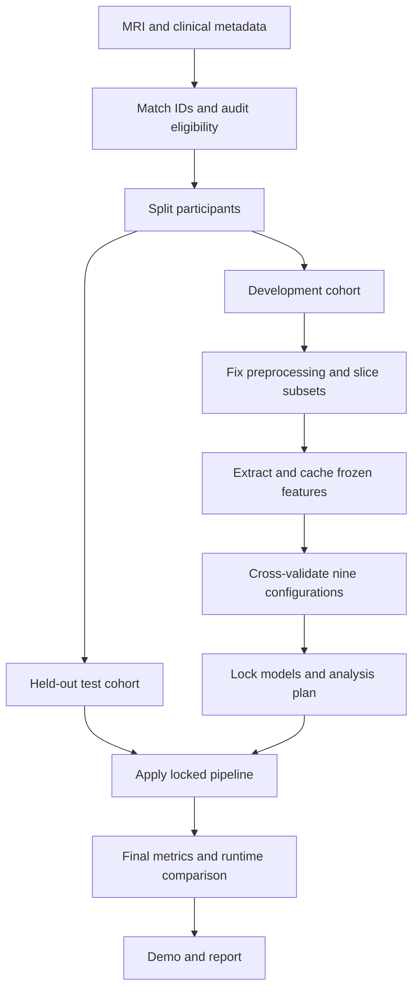
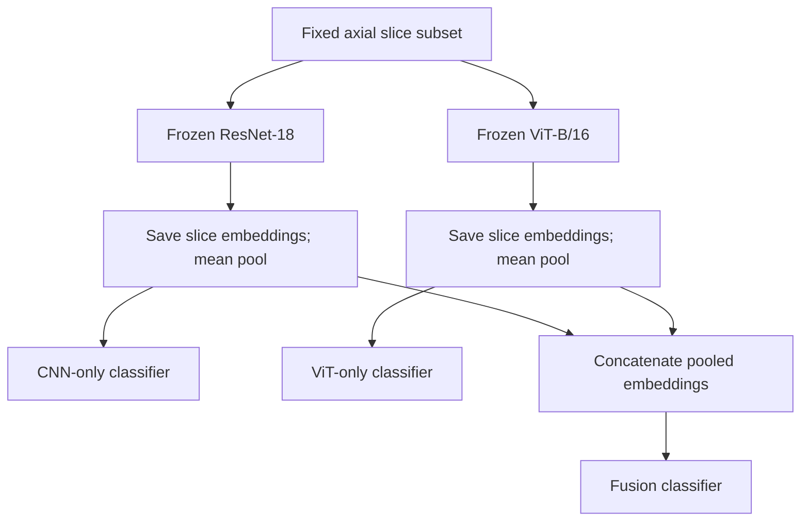

# Dementia CNN–ViT Fusion: Implementation Plan

**Title:** Evaluating CNN–ViT Feature Fusion for Dementia Status Classification under Limited MRI Slice Budgets  
**Scope:** A 10-week semester research prototype; Python familiarity and GPU access assumed.  
**Question:** When does combining CNN and ViT features improve participant-level CDR-group classification enough to justify the additional computation?

## 1. Contribution and feasibility

CNN–Transformer fusion already exists. Our proposed contribution is a reproducible comparison of **three feature representations × three slice budgets**, measuring prediction quality and computation under the same evaluation protocol. This is an empirical study, not a claim of a new architecture or the first such study.

**Required:** OASIS-1, frozen ResNet-18 and ViT-B/16, saved slice features, 4/8/16-slice comparisons, age-only baseline, participant-level evaluation and a simple demo.  
**Optional:** Predefined noise/blur stress tests. Fine-tuning, learned attention, multi-view fusion and external validation are future extensions.

Freezing models and caching features make classifier experiments inexpensive. ViT extraction still costs computation; call the system lightweight only if measurements support it. Allow additional time for dataset access and preprocessing.

## 2. Dataset and target

- [OASIS-1 information](https://sites.wustl.edu/oasisbrains/home/oasis-1/)
- [Official access instructions](https://sites.wustl.edu/oasisbrains/home/access/)
- [OASIS-1 fact sheet](https://sites.wustl.edu/oasisbrains/files/2024/03/oasis_cross-sectional_facts-bcc7a002dfb104f4.pdf)

Obtain structural MRI, clinical metadata and release documentation through the official access process. Prefer the consistently processed, brain-masked, atlas-aligned image product. Confirm its format and anatomical space before coding; do not substitute an untraceable collection of exported slices.

| Item | Rule |
|---|---|
| Target | CDR = 0 → class 0; CDR > 0, including 0.5 → class 1 |
| Missing CDR | Exclude |
| Cohort | Initially age ≥60; report actual eligible counts and exclusions |
| Repeated scans | Select one documented session per participant |
| Interpretation | Predict CDR group; do not equate it with confirmed Alzheimer’s disease |

Create `participants.csv`: `subject_id, session_id, image_path, age, cdr, label, split`. Check label matching and age distributions. Do not promise a final sample count before inspecting the release.

## 3. End-to-end flow

## 4. Implementation sequence

1. **Environment:** Use PyTorch/torchvision, NiBabel, NumPy, pandas, scikit-learn and matplotlib; Streamlit is optional. Record package versions and encoder weight identifiers.
2. **Pilot:** Load 5–10 development participants with their metadata; inspect orientation, shape, masks and anatomy.
3. **Split:** Reserve 20% of participants as a stratified final test set. Use stratified cross-validation within the remaining 80%; use five folds only if class counts permit. Save IDs and a random seed. All data from one participant stay together.
4. **Preprocess:** Confirm registration, apply consistent orientation, normalise within the brain mask, map to a fixed intensity range, resize/pad to the encoder input size, repeat grayscale into three channels, and apply the documented encoder normalisation. Reorientation alone is not registration.
5. **Define slices:** Inspect development images to select 16 fixed axial positions spanning a useful anatomical range. Make spatially distributed 8- and 4-slice subsets nested within these 16. Save exact positions; never select slices using test performance.
6. **Extract:** Put both encoders in evaluation mode, remove classification heads and disable gradients. Extract a 512-value ResNet-18 vector and a 768-value ViT-B/16 vector per slice. ViT context is across one slice, not the entire 3D brain.
7. **Cache:** Save IDs, labels, slice indices, encoder names and per-slice embeddings in `.npz`. Shapes: CNN `N × 16 × 512`; ViT `N × 16 × 768`. Cache before mean pooling so all budgets can reuse it.
8. **Aggregate:** For each budget, average selected slice embeddings separately for each encoder. Concatenate the two averages for a 1,280-value fusion vector.
9. **Train:** For each configuration, use a pipeline of `StandardScaler` and class-balanced logistic regression. Search `C ∈ {0.001, 0.01, 0.1, 1}` using the same development folds and ROC-AUC objective. Fit scaling inside every fold; keep all other tuning budgets equal.
10. **Audit age:** Train an age-only logistic baseline on the same folds. Report group age distributions; this audit does not remove all confounding.
11. **Lock:** Predeclare final comparisons, threshold (default 0.5), perturbations if used, and timing procedure. Select the demo model using development results, then refit each planned model on all development participants.
12. **Test once:** Evaluate the nine locked configurations and age baseline on the same held-out participants. Report all planned comparisons, without choosing a new configuration from test results.
13. **Demo:** Load a supported preprocessed sample; show MRI slices, selected model, CDR-group prediction and model score. Use the saved preprocessing and classifier. A score is not a clinically calibrated risk estimate.
14. **Submit:** Deliver code, configuration, split manifest, result tables, plots, limitations and demonstration. Follow dataset terms when sharing scans or derived features.

## 5. Feature architecture

Each classifier includes its own training-fitted scaler. CNN-only, ViT-only and fusion are independent comparison pipelines.

## 6. Experiments and measurement

| Experiment | Configuration | Purpose |
|---|---|---|
| Core matrix | CNN / ViT / fusion × 4 / 8 / 16 slices | Nine controlled comparisons |
| Confound check | Age-only baseline | Assess how informative age alone is |
| Optional stress test | Clean / mild noise / mild blur | Measure sensitivity to synthetic degradation |

**Prediction metrics:** Participant-level ROC-AUC, balanced accuracy, sensitivity, specificity, F1 and confusion matrix. Add participant-bootstrap 95% confidence intervals; use paired resampling for differences between models. A small test set means uncertainty can be large. Similar point estimates do not establish equivalence.

**Computation:** Measure uncached feature extraction per participant, classifier fitting time and peak GPU memory on the same hardware and batch size. Warm up first; synchronise GPU timing and repeat measurements. For each slice budget, actually process only its selected slices. Retrieving four cached slices is not a measurement of four-slice extraction. Report preprocessing and encoder time separately; fusion includes both branches. Also report cached classifier experimentation time separately.

**Optional robustness:** After fixed mapping to [0,1], predeclare Gaussian noise (for example σ = 0.01) and blur (for example σ = 0.5 pixels), before encoder normalisation. Inspect plausibility using development images only; save seeds and exact settings. Re-extract features from perturbed slices, apply the clean-trained models and compare against clean predictions for the same participants. This tests synthetic perturbations, not real scanner generalisation.

**Interpretation:** Plot ROC-AUC against extraction time. Describe observed trade-offs and uncertainty. Fusion can be worse than CNN-only; a well-controlled negative finding still answers the research question.

## 7. Schedule and deliverables

| Weeks | Output |
|---|---|
| 1–2 | Dataset access, sample loading, cohort audit and participant splits |
| 3 | Fixed preprocessing and nested slice positions |
| 4–5 | Frozen encoders, feature cache and baseline classifier |
| 6 | Nine development comparisons and age baseline |
| 7 | Runtime measurements; optional robustness if core work is complete |
| 8 | Locked final evaluation, confidence intervals and error analysis |
| 9–10 | Demo, report, presentation and viva preparation |

Suggested outputs: `participants.csv`, `config.yaml`, `extract_features.py`, `train_evaluate.py`, `features.npz`, saved classifiers, `results.csv`, metric/runtime plots and `app.py`. An 8–16 GB GPU is a planning estimate for small-batch extraction; validate with the pilot. Reduce batch size if needed.

## 8. Related work and claim boundaries

| Paper | Relevance |
|---|---|
| [Early detection of Alzheimer’s disease progression stages using hybrid of CNN and transformer encoder models — Scientific Reports, 2025](https://www.nature.com/articles/s41598-025-01072-5) | Existing hybrid CNN–Transformer work; fusion alone is not our novelty. |
| [Training ViT with Limited Data for Alzheimer’s Disease Classification: an Empirical Study — MICCAI, 2024](https://papers.miccai.org/miccai-2024/796-Paper2724.html) | Studies ViT training strategies with limited 3D MRI data; our scope uses frozen 2D features and slice-budget comparisons. |
| [A multi-slice attention fusion and multi-view personalized fusion lightweight network for Alzheimer’s disease diagnosis — BMC Medical Imaging, 2024](https://link.springer.com/article/10.1186/s12880-024-01429-8) | Prior slice-attention and view-fusion work; these additions alone are not new. |
| [A Computer Vision Hybrid Approach: CNN and Transformer Models for Accurate Alzheimer’s Detection from Brain MRI Scans — arXiv, 2026](https://arxiv.org/abs/2601.15202) | Additional hybrid prior work; cite as a preprint. |

**Claim to use:** “We evaluate the predictive and computational trade-offs of frozen CNN–ViT feature fusion across limited MRI slice budgets using a controlled participant-level protocol.”

This focused review does not prove a previously unstudied research gap. Participant splitting, caching and transfer learning are methodological choices, not standalone novelty. No model has been trained and no performance or clinical benefit is claimed in this plan.
